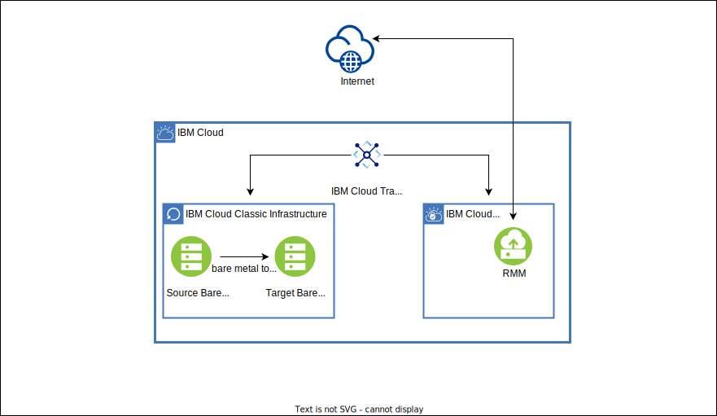
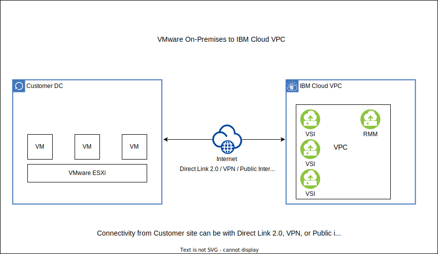

---

copyright:
  years:  2020, 2022
lastupdated: "2022-05-31"

keywords: migration, migrate, migrating, migrate infrastructure, cloud migration

subcollection: cloud-infrastructure

---

{:new_window: target="_blank"}
{:shortdesc: .shortdesc}
{:screen: .screen}
{:pre: .pre}
{:table: .aria-labeledby="caption"}
{:codeblock: .codeblock}
{:tip: .tip}
{:download: .download}
{:external: target="_blank" .external}
{:important: .important}
{:note: .note}
{:row-headers: .row-headers}

# About migration
{: #about-migration-infra}

Your drive to migrate might come from many factors including modernization, cost reduction, consolidation, or data center closure. You also migrate to be more cloud native or adopt new technologies such as VPC. Regardless of the reason, migration can be as simple as migrating a single virtual server instance, or it can be as complex as migrating a piece of your application to a more complex environment where you need to migrate an entire pod or data center with all of the underlying components.
{: shortdesc}

{: caption="Figure 1. Migration approach" caption-side="bottom"}

## Migration approach
{: #migration-approach}

| Step | Description |
|--|--|
|**Assess** | Do you need to migrate instances to a new data center due to data center closures? Do you want to migrate your entire {{site.data.keyword.cloud}} classic infrastructure to VPC? Assess your situation and identify your existing infrastructure to determine what components you have, how they are configured, and what you want to migrate.  \n Not only do you need to assess your current environment, but you need to assess the target environment to understand the capabilities, support, and differences between the two environments, if applicable. In this assessment step, you can get a general idea of the complexity of the migration so that you can develop a migration strategy. |
|**Plan** | Spend time planning for your migration by analyzing your current infrastructure and determining whether your resources and components can be migrated or if there would be any disruptions to your current business environment. Understanding how much time is needed to migrate and whether it needs to be done in stages can help you simplify the migration journey. |
|**Migrate** | After you have spent time assessing your existing infrastructure and planning for your migration, you can migrate your resources and components with ease and confidence. Depending on your migration needs, there are tools available to help you with the migration process. |
|**Validate**  | After you migrate your resources and components into your target infrastructure, and before you make your infrastructure live, you will want to validate and test your environment to ensure it is ready for production. This might also entail updating your DNS and global load balancers, routes, or retiring old services. |
{: caption="Table 1. Migration approach" caption-side="top"} 

## Migration solutions
{: #migration-solutions}

Review the following table to identify the migration solution that best fits your migration needs.

| Solution | Bare metal to bare metal | Bare metal to virtual server | Virtual server to virtual server | Block/File* storage | Network |
| ---- | --- | --- | --- | --- | --- |
| [VPC+ Cloud Migration](/docs/cloud-infrastructure?topic=cloud-infrastructure-about-migration-infra#vpc-cloud-migration) |  |  |  |  |  |
| [RMM](/docs/cloud-infrastructure?topic=cloud-infrastructure-about-migration-infra#rackware-migration) |  |  |  |  |  |
| [DIY automation](/docs/cloud-infrastructure?topic=cloud-infrastructure-about-migration-infra#DIY-automation) |  |  |  |  |  |
| [Custom image templates](/docs/cloud-infrastructure?topic=cloud-infrastructure-about-migration-infra#custom-image-templates) |  |  |  |  |  |
{: caption="Table 2. Classic to classic infrastructure migration" caption-side="bottom"}
{: summary="This table has row and column headers. The row headers identify the migration solution. The column headers identify what can be migrated by using the migration solution. To understand what can be migrated by using a particular solution in the table, navigate to the row, and find the checkmark for the migration motion that you are interested in."}
{: #table01}
{: tab-title="Classic to classic infrastructure"}
{: tab-group="Migration"}
{: class="comparison-tab-table"}
{: row-headers}

| Solution | Bare metal to bare metal | Bare metal to virtual server | Virtual server to virtual server | Block/File* storage | Network |
| ---- | --- | --- | --- | --- | --- |
| [VPC+ Cloud Migration](/docs/cloud-infrastructure?topic=cloud-infrastructure-about-migration-infra#vpc-cloud-migration) |  |  |  |  |  |
| [RMM](/docs/cloud-infrastructure?topic=cloud-infrastructure-about-migration-infra#rackware-migration) |  |  |  |  |  |
| [DIY automation](/docs/cloud-infrastructure?topic=cloud-infrastructure-about-migration-infra#DIY-automation) |  |  |  |  |  |
| [Custom image templates](/docs/cloud-infrastructure?topic=cloud-infrastructure-about-migration-infra#custom-image-templates) |  |  |  |  |  |
{: caption="Table 3. Classic to VPC infrastructure migration" caption-side="bottom"}
{: summary="This table has row and column headers. The row headers identify the migration solution. The column headers identify what can be migrated by using the migration solution. To understand what can be migrated by using a particular solution in the table, navigate to the row, and find the checkmark for the migration motion that you are interested in."}
{: #table02}
{: tab-title="Classic to VPC infrastructure"}
{: tab-group="Migration"}
{: class="comparison-tab-table"}
{: row-headers}

| Solution | Bare metal to bare metal | Bare metal to virtual server | Virtual server to virtual server | Storage | Network |
| ---- | --- | --- | --- | --- | --- |
| [VPC+ Cloud Migration](/docs/cloud-infrastructure?topic=cloud-infrastructure-about-migration-infra#vpc-cloud-migration) |  |  |  |  |  |
| [RMM](/docs/cloud-infrastructure?topic=cloud-infrastructure-about-migration-infra#rackware-migration) |  |  |  |  |  |
| [DIY automation](/docs/cloud-infrastructure?topic=cloud-infrastructure-about-migration-infra#DIY-automation) |  |  |  |  |  |
| [Custom image templates](/docs/cloud-infrastructure?topic=cloud-infrastructure-about-migration-infra#custom-image-templates) |  |  |  |  |  |
{: caption="Table 4. On-premises to VPC infrastructure migration" caption-side="bottom"}
{: summary="This table has row and column headers. The row headers identify the migration solution. The column headers identify what can be migrated by using the migration solution. To understand what can be migrated by using a particular solution in the table, navigate to the row, and find the checkmark for the migration motion that you are interested in."}
{: #table03}
{: tab-title="On-premises to VPC infrastructure"}
{: tab-group="Migration"}
{: class="comparison-tab-table"}
{: row-headers}

*File storage is available in limited MZRs.
{: note}

## VPC+ Cloud Migration
{: #vpc-cloud-migration}

If you want to migrate your {{site.data.keyword.cloud_notm}} classic infrastructure (compute, network, and storage) to VPC, you can use {{site.data.keyword.vpc-plus-migration}}. {{site.data.keyword.vpc-plus-migration}} is a third-party, software-based migration-as-a-service solution, provided by Wanclouds, for migrating components from classic infrastructure to your VPC. {{site.data.keyword.vpc-plus-migration}} allows you to discover and choose resources for migration, create, and set up those resources in your VPC environment. You can also run and manage your VPC environment from within the tool.

You can migrate the following key elements of {{site.data.keyword.cloud_notm}} classic infrastructure to VPC:

* Subnets
* Virtual server instances
* Dedicated hosts
* Storage volumes (primary and secondary)
* Security groups
* Load balancers
* Firewall (ACL) configuration
* VPN configuration
* SSH keys
* Public gateway

For more information, see [Getting started with {{site.data.keyword.vpc-plus-migration}}](/docs/cloud-infrastructure?topic=wanclouds-vpc-plus-getting-started-tutorial).

## RMM
{: #rackware-migration}

RackWare Management Module (RMM) is a third-party solution, provided by RackWare, that provides an automated, easy, and convenient process to migrate existing compute workloads to {{site.data.keyword.cloud_notm}}. It lets you create an exact duplicate of a running source image without the burden of rebuilding or re-creating template images and applications. Migrating large, complex environments through a simple intuitive user interface and automated tasks reduces the time that is required from weeks to days. It keeps track of data changes on source until cutover and performs delta syncs to the target server in {{site.data.keyword.cloud_notm}}. Additionally, it helps you with automated wave planning for migrations that can be further customized.

### Classic to classic infrastructure migration
{: #classic-to-classic-migration-rmm}

You can use RMM solution to simplify the overall bare metal to bare metal migration process. The solution simplifies the process by moving the operating system, applications, and data from one bare metal server to another bare metal server in the {{site.data.keyword.cloud_notm}} classic environment. The migration can occur either over the public or private interface of the compute resource. 

{: caption="Figure 2. Network topology of RMM and bare metal migration" caption-side="bottom"}

Review the following migration considerations and limitations:

* The RMM server is installed on a virtual server instance and is a GUI-based tool.
* The RMM server needs to be able to access both the source and target server over SSH.
* This is a bring-your-own-license (BYOL) solution.
* Only compute resources are migrated, along with secondary volume and secondary block volumes.
* The RMM tool keeps track of data changes on the source server until cutover and performs delta syncs to the target server.

For more a detailed step-by-step guide, see [{{site.data.keyword.cloud_notm}} classic bare metal to bare metal migration](/docs/cloud-infrastructure?topic=cloud-infrastructure-p-p-migration-bare-metal-overview).

For frequently asked questions and answers, see [FAQs for bare metal to bare metal migration](/docs/cloud-infrastructure?topic=cloud-infrastructure-bare-metal-faqs).

### Classic to VPC infrastructure migration
{: #classic-vpc-migration-rmm}

You can use RMM solution to migrate your classic bare metal server to an {{site.data.keyword.vpc_short}} virtual server instance. Migrating from bare metal servers to virtual servers allows you to modernize your environment and adopt virtualization.

{: caption="Figure 3. Migrating over private interface" caption-side="bottom"}

Review the following migration considerations and limitations:

* The RMM server is installed on a virtual server instance and is a GUI-based tool.
* The RMM server needs to be able to access both the source and target server over SSH.
* You get a 3-month promotional license, then you must use BYOL.
* Only compute resources are migrated, along with secondary volume and block volumes.
* The RMM tool keeps track of data changes on the source server until cutover and performs delta syncs to the target server.
* This is a nondisruptive migration.

VPC does not have support for snapshot, replication, and shared volume. You can manage these solutions through the native OS capabilities, tools, or third party of your choice.
{: note}

For more information, see [Bare metal to virtual server migration overview](/docs/cloud-infrastructure?topic=cloud-infrastructure-pv-migration-overview).

For a detailed step-by-step guide on moving your {{site.data.keyword.cloud_notm}} classic bare metal servers to VPC, see [Bare metal to virtual server migration on a private network using RMM](/docs/cloud-infrastructure?topic=cloud-infrastructure-pv-migration-private-network).

For frequently asked questions and answers, see [FAQs for RackWare](/cloud-infrastructure?topic=cloud-infrastructure-rackware-faqs)

### On-premises to VPC infrastructure migration
{: #on-prem-vpc-migration-rmm}

You can use RMM solution to migrate your on-premises workloads to {{site.data.keyword.vpc_short}}.

{: caption="Figure 4. On-premises to VPC migration" caption-side="bottom"}

For a detailed step-by-step guide, see [VMware VM on-premises to {{site.data.keyword.vpc_short}} with RMM](/docs/cloud-infrastructure?topic=cloud-infrastructure-migrating-images-vmware-vpc).

For frequently asked questions and answers, see [FAQs for VMware (on-premises and classic) to VPC migration](/docs/cloud-infrastructure?topic=cloud-infrastructure-faqs-vmware).

### Cloud to VPC infrastructure migration
{: #cloud-vpc-infrastructure}

You can use RMM solution to migrate from other cloud providers to {{site.data.keyword.vpc_short}}.

{: caption="Figure 5. Other cloud providers to VPC migration" caption-side="bottom"}

You can migrate your workloads from the following cloud providers:

* AWS
* Azure
* GCP
* OCI (bare metal)

For a detailed step-by-step guide, see [AWS, Azure, GCP, and OCI workloads to {{site.data.keyword.vpc_short}}](/docs/cloud-infrastructure?topic=cloud-infrastructure-aws-azure-gcp-and-oci-workloads-to-ibm-cloud-vpc-vsi-migration-with-rackware-rmm).

## DIY automation
{: #DIY-automation}

There are several do-it-yourself (DIY) automation scripts made available to migrate workloads and data to {{site.data.keyword.cloud_notm}}. The automation scripts are starter scripts that you can modify or adapt to your environment. 

Since these scripts are open-sourced and without charge for use, there is no support or SLAs. For more information, see [Getting help and support for image and data migration](/docs/cloud-infrastructure?topic=cloud-infrastructure-getting-help-support-image-data-migration).
{: note}

There are three available sets of DIY automation scripts for you to use:

|Tool  |Description  |
|-------|-------|
|Virtual server preparation and validation tool  |- This tool ensures that the guest machine that you want to import to VPC as a custom image meets the [minimum requirements](/docs/vpc?topic=vpc-about-images#custom-image-reqs).  \n - The script is available in this [public GitHub repository](https://github.com/IBM-Cloud/vpc-migration-tools/tree/main/os-precheck-scripts){: external}.  |
|Image conversion tool   |- You can convert VMDK and VDH images to qcow2 from anywhere to VPC.  \n - You can upload an image to {{site.data.keyword.cos_full_notm}} and import it to VPC as a custom image.  \n - The script is available in this [public GitHub repository](https://github.com/IBM-Cloud/vpc-migration-tools/tree/main/image-conversion){: external}.  \n - For a detailed step-by-step guide, see [Migrating VMDK or VHD images to VPC](/docs/cloud-infrastructure?topic=cloud-infrastructure-migrating-images-vpc).|
|Data migration tool  | - You can migrate your data from anywhere to {{site.data.keyword.cloud_notm}} classic infrastructure or VPC.  \n - The tool uses `rsync` to copy data from the source to the target machine.  \n - The script is available in this [public GitHub repository](https://github.com/IBM-Cloud/vpc-migration-tools/tree/main/data-migration){: external}.  \n - For a detailed step-by-step guide, see [Migrating data from {{site.data.keyword.cloud_notm}} classic infrastructure to VPC](/docs/cloud-infrastructure?topic=cloud-infrastructure-data-migration-classic-to-vpc).  |
{: caption="Table 5. Available DIY automation scripts" caption-side="top"} 

## Custom image templates
{: #custom-image-templates}

By using a custom image template, you can capture a classic bare metal image to replicate its configuration to order more classic bare metal servers with the same configurations, and you can deploy as many as needed. 

With this type of bare metal to bare metal migration in {{site.data.keyword.cloud_notm}} classic infrastructure, you need to review the following considerations and limitations:

* Only compute resources and secondary volumes are migrated
* Not meant for backup 
* Can be used for disaster recovery

Classic bare metal to bare metal migration is disruptive to your workloads, so be sure to plan accordingly.
{: important}

For more information, see [About bare metal custom image templates](/docs/bare-metal?topic=bare-metal-getting-started-bm-custom-image-templates).
